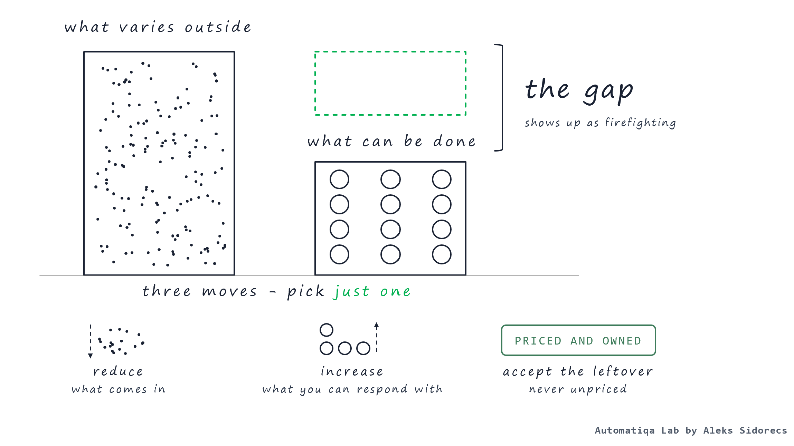

# Requisite variety in supply chain

*Heuristic 01. Published 8 September 2026 on [automatiqa.io](https://www.automatiqa.io/heuristics/01-requisite-variety-in-supply-chain/).*

## Problem

### What is requisite variety in supply chain?

**Requisite variety in the supply chain shows that any department can control only as much variation as it can absorb, and everything beyond that brings associated costs, delays, or constant troubleshooting.**

The supply chain world is a brutal place where professionals continuously fight against entropy. Each day, week, or month, it challenges practitioners' skills and ability to respond across logistics, procurement, manufacturing, or warehousing domains. Even with deterministic processes, systems, and tools, we still can't respond to the non-determinism of that reality. This gap never reveals itself directly because it hides behind rush orders to customers, sudden stock-level changes nobody can explain, or exception handling that becomes a full-time job. Another frequent signal we might overlook is the escalations that operators trigger when they see the problem but aren't allowed to act on it.

## Why it's hard

### Somebody has been paying for it all along

**Every counteraction taken as a response to the problem adds costs or complexity to the operating model.** When we remove variation from the entropy equation, it costs us flexibility or revenue. The individuals who're in the front driving seat are often the ones who're rarely empowered enough to respond to it. I ran transformation playbooks myself a few times before the maths caught up with me.

## The rule

### Three activities, pick one

**The operating model of any company can only control such factors that it can keep up with.** In general, there're three activities that supply chain professionals can perform:

- **reduce — Reduce what comes in.** You know it through standard specifications, buffer inventories or capacity, contract terms that limit surprises and other.
- **increase — Increase what you can absorb.** Let the edge of your organisation decide or get finer details of operations through more robust data models. Ensure there're more options to act, execute the workflow loops faster, use AI and [agentic solutions](https://www.automatiqa.io/oodaa/) to multiply response velocity.
- **accept — Accept what is left.** It's a conscious organisational choice by design as it should get an assigned price or cost, and clear ownership allocation.

> **Formula**
>
> **Vr &ge; Ve**
>
> Where Ve (environment) represents the number of distinct situations the operation faces. At the same time, Vr (response) is the number of distinct actions the supply chain can take at each time step. Operational control fails whenever Vr is smaller than Ve. I've adapted it from the works of W. Ross Ashby on [cybernetics](https://en.wikipedia.org/wiki/Variety_%28cybernetics%29).

## Test

### Which layer is short?

Nothing complicated here, just have a look at the operational challenges. Pick the one that keeps coming back to your team, repeatedly. When you slice it, clarity will come with what layer is actually short:

1. **Can't see it** — The signal never reaches anyone in time.
2. **Can see, can't act** — The person who sees it has no right to respond.
3. **Can act one way** — There's a single lever, and it's always the expensive one.
4. **Right action, too late** — The loop closes after the damage is done.

**Focus on addressing that layer, not the noisiest one.**

## Run on

> A case from the construction materials sector I worked in some time ago. Our customers could place same-day orders until late morning at no cost. The plants saw orders as they came; the dispatcher had the right to act. We lacked several response options for a variety of operational needs, and every morning became a continuous fight over available drivers to meet demand.
>
> We didn't add more drivers, additional trucks, or sophisticated software to increase the response velocity. Instead, we shifted the customer order cut-off time to the previous afternoon and priced same-day execution. As a result, the most urgent customer requests vanished overnight, and the rest paid for the overtime.
>
> The variation was still there. What changed - the customers were no longer sending it to us for free.

## How this rule gets misapplied

- More reports and data don't give real control over your operations. It just breeds illusions unless they really change what someone can do.
- Centralisation with wrong mindset likely to take the response velocity from the edges and reduce overall operating model capacity to absorb variety at the relevant nodes.
- Trying to eliminate the leftovers instead of pricing it - some variation is the real business; with a right mindset it can be translated into additional profit streams.

---

> **Match the variety or pay for the difference.**
