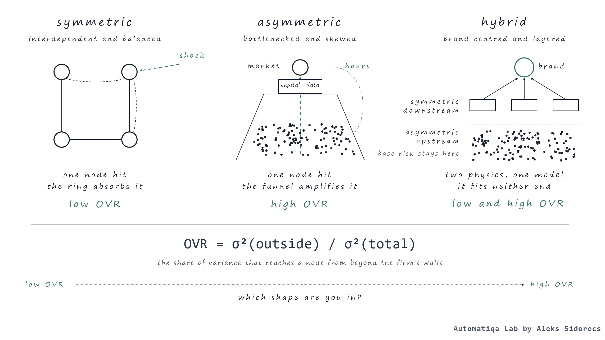

# Asymmetric supply chain physics

*Heuristic 02. Published 16 September 2026 on [automatiqa.io](https://www.automatiqa.io/heuristics/02-asymmetric-supply-chain-physics/).*

## Problem

### When do classical supply chain strategies stop working?

**When I review various operations management playbooks, I often find theories and concepts built on one unspoken assumption: symmetry.**

It doesn't mean they're wrong; I've seen and managed symmetric models across consumer goods, automotive, life sciences, and other sectors. Buyers and suppliers are highly interdependent and operate in a relatively predictable environment, often guided by aligned principles such as shared data, balanced risk, and mutual leverage.

Then I moved into a different industry vertical built around 12.5 million smallholder farmers worldwide. Welcome to the soft-commodities and agrifood sector. There are no conveyor belts; weather and climate shape my supply chain strategy as much as, and sometimes more than, the company's P&L. Traditional frameworks break down, and conventional experience becomes irrelevant. To be clear, I wasn't dealing with a broken supply chain. I had simply moved into a different universe, operating under a different algorithm and physics.

## Why it's hard

### Same tools and operating modes, but wrong physics

**Symmetric supply chains are built on Newtonian logic.** If a product promotion drives a 5% sales increase in retail, it triggers relatively linear behaviour across all nodes involved, including distributors, brand manufacturers, Tier-1 and Tier-2 vendors for chemicals and packaging, and so on. Cause and effect are roughly proportional, and a standard ERP or APO system handles it well.

Asymmetric supply chains are different because they run on a different fuel - chaos theory. A weather anomaly, such as frost in Minas Gerais, a micro-region in Brazil, might trigger commodity exchange algorithms and reprice the entire market within hours. This will consequently affect international physical flows, container availability at ports, and warehouse capacity at destinations - in days, not months.

To make things even more challenging, asymmetric operations often manifest in two forms. The frost example is idiosyncratic because only one supply chain node fails. Another form is represented by a super El Niño weather pattern. It triggers a wave of multi-node issues worldwide, with dry weather in Brazil, through East Africa, and highly humid conditions in Vietnam. All nodes fail together within a 12-month window, making it impossible for farmers to grow high-yield crops to meet global market demand.

As a result, when practitioners approach asymmetric realities with a symmetric toolkit and playbooks, whether standard contracts, software, or process excellence, it feels like measuring temperature with a ruler.

## The rule

### One question facing three architectures

**Before selecting any technology or solution, setting functional objectives, or deciding on an operating model's architecture, practitioners should define which shape they're facing.** Without this step, it's hard to make any design call, and professionals risk making ones that don't fit the real physics their business faces.

- **symmetric — Interdependent and balanced.** Symmetry is a form of dependency that creates balance. When both parties have access to each other's information and decision-making, they create partnerships based on mutual dependence and sometimes - shared assets. This type of partnership creates transparency, so all partners know their role in the supply chain and what is expected of each participant. The most common examples of this type of physics exist within the automotive and manufacturing industries. When external, non-deterministic factors hit one node, the whole ecosystem adjusts to restore the supply chain to homeostasis: inventory, production capacity, and other elements.
- **asymmetric — Bottlenecked and skewed.** The "funnel" shape indicates an asymmetrical operating model. At the lower end of the funnel, we often find a fragmented, unevenly distributed network of participants, comprising mainly artisanal producers and small and medium-sized enterprises. Market access and most value-added activity occur in and are controlled by the mid-section. At the neck (narrowest point): capital and data. Agricultural production and raw material extraction best represent such physics in operations. With non-deterministic negative factors, compared to symmetric structures, there's nothing to adjust around them; the shock travels up the funnel to the market and back down to the base, which absorbs it.
- **hybrid — Centred around the brand and layered.** A brand-centred hybrid is recognisable by how much it influences trends, inventory allocations, and overall market dynamics. The most typical hybrid physics exists in the fashion and Sportswear industry verticals.

  Operating models generally have a low-risk, asset-light structure, which means they rarely take on internal production/execution risks and prefer outsourcing. At the same time, hybrid structures don't absorb external shocks evenly. This is defined by contractual arrangements between the network's agents: the brand owner and contract manufacturing network absorb different halves of the shock. For example, demand and inventory risk stay with the brand; execution and capacity risk stay with the supplier. The supply chain restores itself as long as neither side's half exceeds what it was designed to carry.

  At the same time, the companies I worked for ran on hybrid physics: asymmetries existed upstream, and they executed symmetric flows downstream. Normally, this starts creating process contradictions because the operating model gets stretched across both ends of the spectrum and fits into neither.

> **x = σ²(outside) / σ²(total)**
>
> The situation discussed in previous parts of this heuristic can also be expressed mathematically. The simplest equation that comes to mind is the formula stated above. σ² (sigma squared) refers to the variance at a node. It covers variables such as order volume, lead time, yields, and other relevant factors. σ² (total) is the total variance faced across operations. σ² (outside) represents the variance attributable to factors outside the company's walls.
>
> So, what is the conclusion? When we calculate x, it shows the share of variance driven by factors outside the company's walls. It can be weather and climate issues, price and cost volatility, new regulations, and other factors. Low x indicates symmetric physics, while asymmetries occur at higher x.
>
> [Heuristic 01](../01-requisite-variety-in-supply-chain/) requires V(response) ≥ V(environment). The current one defines the source of V(environment). x is the field estimate behind the third test question that follows, and it is ordinal in practice - no need to measure it to two decimals.

## Test

### Which shape are you in?

Three things to question for each of your end-to-end flows. Validate them on a flow level, not company or business unit. As mentioned earlier on hybrid physics, any company may have an upstream flow in one form and a downstream flow in another. Answer from the most recent 12 months of incidents, not from the value stream map.

1. **Do you choose your suppliers, or do they choose you?**
2. **Plan within error of 10%** — Can you forecast next quarter's incoming volume with an error of less than 10%?
3. **Inside or outside** — When something gets wrong, is the cause of problems usually inside your walls or outside them?

**Two or more "outside" answers, and you are asymmetric, whatever the value stream map says.**

## Run on

> Since April 2026, I've been reading global climate reports as supply chain strategy documents and spending time with in-house and external climate experts. Some peers asked why. The WMO had warned that a new El Niño is likely to strengthen through 2026, possibly into one of the strongest on record, peaking, as usual, around Christmas.
>
> I ran the three questions on the agricultural network I work with. The suppliers choose us. Next quarter's inflow depends on rain. The cause sits in the Pacific. Three "outside" answers.
>
> So, the forecast stops being just a climate report and becomes a strategic plan. Origin qualification had to be moved forward in time - an alternate origin activation takes months, so the call went out on a weather forecast, not on a basis of existing conditions. It shapes where we'll hold stock buffers and how far ahead of the El Niño peak to act. Consequently, we mapped which new port pairs would activate under several scenarios for volume drift between impacted origins, and repriced working capital due to longer transit times and larger inventory buffers. The forecast peaks around Christmas. The architecture was set long before.

## How this rule gets misapplied

- Deploying Lean Six Sigma or continuous improvement initiatives on an asymmetric supply chain. There's a strong chance it would optimise buffers and standardise a lot of workflows that silently absorbed outside variability.
- Driving supply base diversification and alternative sourcing initiatives, missing the part that they all depend on one common driver - one climate system, one port, one currency, one sub-tier source. It looks diversified on paper, but risk isn't compressed at all.
- Licensing or building planning solutions/tools for symmetric demand and giving it a forecast you don't control - a harvest, an artisanal mine, a driver pool. The plan is precise but becomes perfectly wrong.

## Related heuristics

[Heuristic 01](../01-requisite-variety-in-supply-chain/) says to match the variety or pay for the difference. Heuristic 02 tells where the variety comes from and where it lands.

---

> **Diagnose the shape before you prescribe the cure.**
